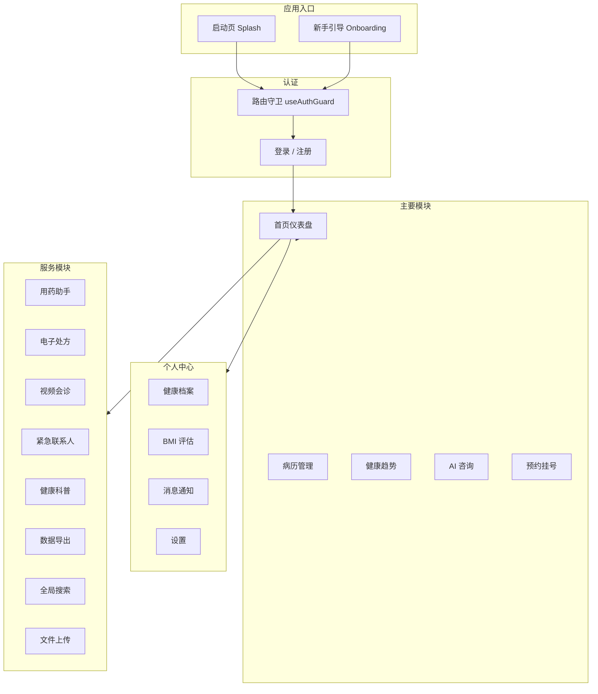

<div align="center">

# HealthCare

**智能健康管理平台** — 病历管理 / 健康监测 / AI 咨询 / 预约挂号


</div>

---

> HealthCare 围绕 **「健康档案建立 → 病历管理 → 健康趋势监测 → AI 智能咨询 → 预约挂号 → 数据导出」** 构建一站式移动端健康管理应用。
>
> 基于 uni-app 跨平台框架，支持 H5 和微信小程序，面向患者和普通用户，提供健康数据管理、医疗咨询和生活化健康管理服务。

---

<!-- 截图待补充 -->

## 目录

- [核心功能](#核心功能)
- [技术栈](#技术栈)
- [应用架构](#应用架构)
- [项目结构](#项目结构)
- [页面清单](#页面清单)
- [快速开始](#快速开始)
- [演示账号](#演示账号)
- [工程优化](#工程优化)
- [使用指南](#使用指南)
- [开发指南](#开发指南)
- [许可证](#许可证)

---

## 核心功能

<table>
<tr>
<td width="50%">

**健康数据仪表盘**
<br/>
心率、血压、血糖、BMI 等核心指标实时监测，7 天趋势变化一目了然，快速掌握身体状况。

</td>
<td width="50%">

**病历管理**
<br/>
病历列表按时间/类型筛选排序，详情页展示诊断信息、检查报告、AI 分析结果，支持图片和 PDF 上传。

</td>
</tr>
<tr>
<td width="50%">

**AI 智能咨询**
<br/>
基于关键词匹配的模拟医疗问答，覆盖常见疾病、用药指导、健康建议等场景。

</td>
<td width="50%">

**预约挂号**
<br/>
四步流程：选择科室 → 查看医生 → 选择时段 → 确认预约。支持科室分类和医生信息展示。

</td>
</tr>
<tr>
<td width="50%">

**个人健康档案**
<br/>
结构化管理身高、体重、血型、过敏史、既往病史、家族病史，构建完整的个人健康画像。

</td>
<td width="50%">

**健康趋势分析**
<br/>
基于 ECharts 的多维度数据可视化，包含折线图、柱状图、雷达图等，数据驱动健康决策。

</td>
</tr>
<tr>
<td width="50%">

**用药助手**
<br/>
药品信息管理、用药提醒设置、药物交互警示，保障用药安全。

</td>
<td width="50%">

**数据导出**
<br/>
健康报告、病历记录、用药记录一键导出为 PDF 或 Excel 格式，方便就医时携带。

</td>
</tr>
</table>

---

## 技术栈

### 前端框架

| 技术 | 版本 | 用途 |
| --- | --- | --- |
| Vue 3 | 3.x | UI 框架 (Composition API) |
| uni-app | 5.08 | 跨平台开发框架 |
| Vite | 5.x | 构建工具 |
| SCSS | 3.x | 样式预处理 |

### 数据与可视化

| 技术 | 版本 | 用途 |
| --- | --- | --- |
| ECharts | 5.x | 健康数据图表可视化 |
| uni-ui | - | 基础 UI 组件库 |

### 目标平台

| 平台 | 说明 |
| --- | --- |
| H5 | 移动端 Web 应用 (Chrome / Safari) |
| 微信小程序 | 通过微信开发者工具运行 |

---

## 应用架构



---

## 项目结构

```
HealthCare/
├── src/
│   ├── pages/                    # 26 个页面
│   │   ├── splash/               # 启动页 (品牌展示 + 自动跳转)
│   │   ├── onboarding/           # 新手引导 (3 页滑动)
│   │   ├── login/                # 登录 / 注册
│   │   ├── home/                 # 首页仪表盘 + 8 宫格入口
│   │   ├── records/              # 病历管理 (列表 + 详情)
│   │   ├── chatbot/              # AI 智能咨询
│   │   ├── trends/               # 健康趋势 (ECharts 图表)
│   │   ├── medication/           # 用药助手
│   │   ├── health-profile/       # 个人健康档案
│   │   ├── bmi/                  # BMI 健康评估
│   │   ├── appointment/          # 预约挂号 (4 步流程)
│   │   │   ├── index.vue         #   科室选择
│   │   │   ├── doctors.vue       #   医生列表
│   │   │   ├── schedule.vue      #   时段选择
│   │   │   └── confirm.vue       #   确认预约
│   │   ├── articles/             # 健康科普 (列表 + 详情)
│   │   ├── notification/         # 消息通知中心
│   │   ├── export/               # 数据导出
│   │   ├── search/               # 全局搜索
│   │   ├── prescription/         # 电子处方
│   │   ├── video/                # 视频会诊
│   │   ├── emergency/            # 紧急联系人
│   │   ├── upload/               # 文件上传
│   │   ├── settings/             # 设置
│   │   └── my/                   # 个人中心
│   ├── components/               # 公共组件 (7 个)
│   │   ├── AppHeader.vue         # 页面顶栏
│   │   ├── BottomNav.vue         # 底部导航栏
│   │   └── HealthDashboard.vue   # 健康仪表盘组件
│   ├── composables/              # 组合式函数
│   │   ├── useAuth.js            # 认证状态管理
│   │   └── useAuthGuard.js       # 路由守卫
│   ├── config/
│   │   └── index.js              # 全局配置
│   ├── static/                   # 静态资源 + Mock 数据
│   ├── styles/                   # 全局样式
│   ├── pages.json                # 路由配置 (26 页)
│   ├── manifest.json             # 应用配置
│   ├── App.vue                   # 根组件
│   └── main.js                   # 入口文件
├── docs/                         # 项目文档
├── package.json
└── README.md
```

---

## 页面清单

| # | 页面 | 路径 | 功能说明 |
| --- | --- | --- | --- |
| 1 | 启动页 | `pages/splash/splash` | 品牌展示 + 2 秒自动跳转 |
| 2 | 新手引导 | `pages/onboarding/onboarding` | 3 页滑动引导，首次启动显示 |
| 3 | 登录 | `pages/login/login` | 手机号 + 密码登录 / 注册 |
| 4 | 首页 | `pages/home/home` | 健康仪表盘 + 搜索栏 + 8 宫格服务入口 |
| 5 | 病历列表 | `pages/records/list` | 按时间/类型筛选，AI 标签展示 |
| 6 | 病历详情 | `pages/records/detail` | 诊断信息 + 图片 + AI 分析结果 |
| 7 | AI 咨询 | `pages/chatbot/chat` | 智能问答对话界面 |
| 8 | 健康趋势 | `pages/trends/trends` | ECharts 多维度图表 |
| 9 | 用药助手 | `pages/medication/medication` | 药品管理 + 交互警示 |
| 10 | 健康档案 | `pages/health-profile/health-profile` | 结构化健康信息管理 |
| 11 | BMI 评估 | `pages/bmi/bmi` | 计算器 + 等级判定 + 健康建议 |
| 12 | 预约-科室 | `pages/appointment/index` | 科室分类列表 |
| 13 | 预约-医生 | `pages/appointment/doctors` | 医生信息卡片 |
| 14 | 预约-时段 | `pages/appointment/schedule` | 日期 + 时段选择 |
| 15 | 预约-确认 | `pages/appointment/confirm` | 预约信息确认 |
| 16 | 健康科普 | `pages/articles/index` | 分类文章列表 |
| 17 | 文章详情 | `pages/articles/detail` | 文章内容 + 相关推荐 |
| 18 | 消息通知 | `pages/notification/notification` | 分类消息 + 未读角标 |
| 19 | 数据导出 | `pages/export/export` | 导出类型 + 格式选择 |
| 20 | 全局搜索 | `pages/search/search` | 跨模块搜索 |
| 21 | 电子处方 | `pages/prescription/prescription` | 处方详情展示 |
| 22 | 视频会诊 | `pages/video/video` | 视频通话 (演示) |
| 23 | 紧急联系人 | `pages/emergency/emergency` | 联系人列表管理 |
| 24 | 文件上传 | `pages/upload/upload` | 图片 / PDF 上传 |
| 25 | 设置 | `pages/settings/settings` | 偏好 / 隐私 / 关于 |
| 26 | 个人中心 | `pages/my/my` | 用户信息 + 分组功能入口 |

---

## 快速开始

### 环境要求

- Node.js >= 16
- npm >= 7

### 1. 克隆项目

```bash
git clone https://github.com/jjjojoj/HealthCare.git
cd HealthCare
```

### 2. 安装依赖

```bash
npm install
```

### 3. 启动 H5 开发服务器

```bash
npm run dev:h5
```

浏览器访问 `http://localhost:5174`，建议使用 Chrome DevTools 手机模拟器 (F12 / 设备图标) 预览移动端效果。

### 4. 微信小程序

```bash
npm run dev:mp-weixin
```

使用微信开发者工具导入 `dist/dev/mp-weixin` 目录。

### 5. 使用 HBuilderX

1. 下载安装 [HBuilderX](https://www.dcloud.io/hbuilderx.html)
2. 导入本项目
3. 运行 → 运行到浏览器 / 运行到小程序模拟器

---

## 演示账号

| 字段 | 值 |
| --- | --- |
| 用户名 | `demo` |
| 密码 | `demo` |

---

## 工程优化

### 应用流程设计

| 环节 | 说明 |
| --- | --- |
| 启动页 | 品牌展示 + 2 秒延时自动跳转，`onLaunch` 中判断是否首次使用 |
| 新手引导 | 3 页滑动引导页，完成后写入 `localStorage` 标记，后续不再显示 |
| 路由守卫 | `useAuthGuard` 拦截需登录页面，未认证自动跳转登录页 |
| 认证管理 | `useAuth` 管理登录状态，`localStorage` 持久化 token |

### 页面设计规范

- **移动端优先** — 所有页面基于 375px 宽度设计，响应式适配
- **无 emoji** — 严肃医疗应用风格，使用文字和图标替代 emoji
- **简约高大上** — 蓝色主题，干净排版，留白充足
- **统一导航** — `AppHeader` 顶栏 + `BottomNav` 底部导航栏

### 数据层

- **纯前端 Mock** — 所有数据为本地模拟，无后端依赖
- **localStorage** — 认证 token (`healthcare_token`)、用户信息 (`healthcare_userInfo`)、首次标记

---

## 使用指南

### 首次使用

1. 打开应用，进入启动页
2. 首次使用显示 3 页新手引导，滑动浏览后点击进入登录
3. 使用演示账号登录 (demo / demo)
4. 进入首页，查看健康仪表盘和功能入口

### 日常使用

1. **首页** — 查看健康指标概览，通过 8 宫格快速进入各功能模块
2. **病历管理** — 浏览历史病历，查看诊断详情和 AI 分析结果
3. **健康趋势** — 查看各项指标的 7 天趋势图表
4. **预约挂号** — 选择科室 → 医生 → 时段 → 确认预约
5. **AI 咨询** — 在对话框中输入症状或健康问题，获取建议
6. **数据导出** — 导出健康报告，就医时展示给医生

---

## 开发指南

### 可用脚本

```bash
npm run dev:h5          # 启动 H5 开发服务器 (端口 5174)
npm run build:h5        # H5 生产构建
npm run dev:mp-weixin   # 微信小程序开发模式
npm run build:mp-weixin # 微信小程序构建
```

### 开发规范

- **路由配置** — 新增页面需在 `pages.json` 中注册路由
- **状态管理** — 使用 `composables` 组合式函数管理共享状态
- **Mock 数据** — 页面内联 Mock 数据，存放在 `static/` 目录
- **样式方案** — 全局样式在 `styles/` 目录，页面样式使用 `<style lang="scss" scoped>`

---

## 许可证

本项目采用 [MIT 许可证](LICENSE)。

---

<div align="center">

**HealthCare** — 用科技守护每一次健康

</div>
