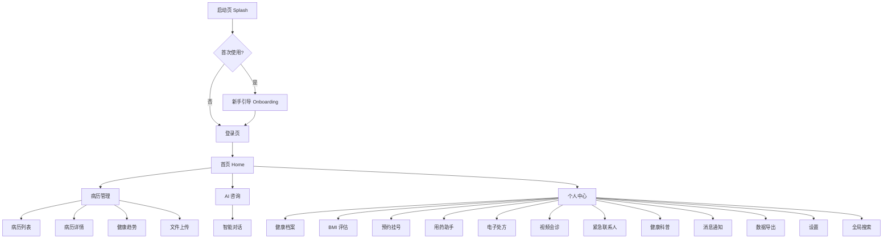

<p align="center">
  <h1 align="center">HealthCare</h1>
  <p align="center">智能健康管理平台</p>
</p>

> 基于 uni-app + Vue3 的移动端健康管理应用，涵盖健康档案、病历管理、预约挂号、用药助手、AI 智能咨询等完整医疗场景。纯前端演示项目，全部 Mock 数据。

[](https://vuejs.org/)
[](https://uniapp.dcloud.net.cn/)
[](https://vitejs.dev/)
[](https://echarts.apache.org/)
[](https://sass-lang.com/)
[](LICENSE)

---

## 功能总览



### 核心功能

| 模块 | 说明 |
|------|------|
| 应用流程 | 启动页 / 新手引导(3页) / 登录 / 注册 |
| 健康仪表盘 | 心率、血压、血糖、BMI 等核心指标实时监测 + 7 天趋势 |
| 病历管理 | 病历列表(筛选/排序)、详情查看、AI 分析结果展示 |
| 预约挂号 | 科室选择 / 医生列表 / 时段预约 / 确认挂号(4步流程) |
| AI 智能咨询 | 基于关键词匹配的模拟医疗问答聊天 |
| 用药助手 | 药品列表、用药提醒、药物交互警示 |
| 健康趋势 | ECharts 多维度数据可视化图表 |
| 个人健康档案 | 身高/体重/血型/过敏史/既往病史/家族病史结构化管理 |
| BMI 健康评估 | 输入身高体重自动计算 + 等级判定 + 健康建议 |
| 健康科普 | 分类文章列表(慢病管理/用药常识/养生保健等) + 文章详情 |
| 消息通知 | 用药提醒 / 复查提醒 / 系统消息，未读角标 |
| 数据导出 | 健康报告 / 病历记录 / 用药记录导出(PDF/Excel) |
| 全局搜索 | 搜索病历、药品、科普文章，搜索历史 + 热门搜索 |
| 电子处方 | 处方详情展示 |
| 视频会诊 | 视频通话界面(演示) |
| 紧急联系人 | 联系人列表管理 |
| 设置 | 通知偏好 / 隐私设置 / 清除缓存 / 关于 / 检查更新 |

---

## 技术栈

| 技术 | 版本 | 说明 |
|------|------|------|
| Vue 3 | 3.x | Composition API |
| uni-app | 5.08 | 跨平台框架 |
| Vite | 5.x | 构建工具 |
| ECharts | 5.x | 数据可视化 |
| SCSS | 3.x | 样式预处理 |
| uni-ui | - | 基础组件库 |

目标平台: H5 / 微信小程序

---

## 快速开始

### 环境要求

- Node.js >= 16
- npm >= 7

### 安装

```bash
git clone https://github.com/jjjojoj/HealthCare.git
cd HealthCare
npm install
```

### 运行

```bash
# H5 开发模式 (端口 5174)
npm run dev:h5

# H5 构建
npm run build:h5

# 微信小程序
npm run dev:mp-weixin
```

浏览器访问 `http://localhost:5174`

> H5 模式下建议使用 Chrome DevTools 手机模拟器 (F12 / 设备图标) 预览移动端效果。

---

## 演示账号

| 字段 | 值 |
|------|-----|
| 用户名 | `demo` |
| 密码 | `demo` |

---

## 项目结构

```
HealthCare/
├── src/
│   ├── components/            # 公共组件 (7个)
│   │   ├── AppHeader.vue      # 页面顶栏
│   │   ├── BottomNav.vue      # 底部导航
│   │   └── HealthDashboard.vue # 健康仪表盘组件
│   ├── composables/           # 组合式函数
│   │   ├── useAuth.js         # 认证状态管理
│   │   └── useAuthGuard.js    # 路由守卫
│   ├── config/
│   │   └── index.js           # 全局配置(存储Key等)
│   ├── pages/                 # 26 个页面
│   │   ├── splash/            # 启动页
│   │   ├── onboarding/        # 新手引导
│   │   ├── login/             # 登录注册
│   │   ├── home/              # 首页
│   │   ├── records/           # 病历(列表+详情)
│   │   ├── chatbot/           # AI 咨询
│   │   ├── trends/            # 健康趋势
│   │   ├── meds/              # 用药助手
│   │   ├── health-profile/    # 健康档案
│   │   ├── bmi/               # BMI 评估
│   │   ├── appointment/       # 预约挂号(4页)
│   │   ├── articles/          # 健康科普(列表+详情)
│   │   ├── notification/      # 消息通知
│   │   ├── export/            # 数据导出
│   │   ├── search/            # 全局搜索
│   │   ├── prescription/      # 电子处方
│   │   ├── video/             # 视频会诊
│   │   ├── emergency/         # 紧急联系人
│   │   ├── upload/            # 文件上传
│   │   ├── settings/          # 设置
│   │   └── my/                # 个人中心
│   ├── static/                # 静态资源 + Mock 数据
│   ├── styles/                # 全局样式
│   ├── pages.json             # 路由配置
│   ├── manifest.json          # 应用配置
│   ├── App.vue
│   └── main.js
├── docs/                      # 项目文档
├── package.json
└── README.md
```

---

## 页面清单

| # | 页面 | 路径 | 说明 |
|---|------|------|------|
| 1 | 启动页 | pages/splash/splash | 品牌展示 + 自动跳转 |
| 2 | 新手引导 | pages/onboarding/onboarding | 3 页滑动引导 |
| 3 | 登录 | pages/login/login | 登录/注册表单 |
| 4 | 首页 | pages/home/home | 仪表盘 + 8 宫格入口 |
| 5 | 病历列表 | pages/records/list | 筛选/排序/AI 标签 |
| 6 | 病历详情 | pages/records/detail | 详情 + 图片 + AI 分析 |
| 7 | AI 咨询 | pages/chatbot/chat | 智能问答对话 |
| 8 | 健康趋势 | pages/trends/trends | ECharts 图表 |
| 9 | 用药助手 | pages/meds/meds | 药品管理 + 交互警示 |
| 10 | 健康档案 | pages/health-profile/health-profile | 结构化健康信息 |
| 11 | BMI 评估 | pages/bmi/bmi | 计算器 + 等级 + 建议 |
| 12 | 预约-科室 | pages/appointment/index | 科室选择列表 |
| 13 | 预约-医生 | pages/appointment/doctors | 医生信息列表 |
| 14 | 预约-时段 | pages/appointment/schedule | 日期 + 时段选择 |
| 15 | 预约-确认 | pages/appointment/confirm | 确认预约信息 |
| 16 | 健康科普 | pages/articles/index | 分类文章列表 |
| 17 | 文章详情 | pages/articles/detail | 文章内容 + 相关推荐 |
| 18 | 消息通知 | pages/notification/notification | 分类消息 + 未读 |
| 19 | 数据导出 | pages/export/export | 导出类型 + 格式选择 |
| 20 | 全局搜索 | pages/search/search | 跨模块搜索 |
| 21 | 电子处方 | pages/prescription/prescription | 处方详情 |
| 22 | 视频会诊 | pages/video/video | 视频通话(演示) |
| 23 | 紧急联系人 | pages/emergency/emergency | 联系人管理 |
| 24 | 文件上传 | pages/upload/upload | 图片/PDF 上传 |
| 25 | 设置 | pages/settings/settings | 偏好/隐私/关于 |
| 26 | 个人中心 | pages/my/my | 用户信息 + 功能入口 |

---

## 截图

> 待补充

---

## 文档

| 文档 | 说明 |
|------|------|
| [UI 设计规范](docs/H5_DESIGN_SPEC.md) | H5 端设计规范 |

---

## 许可证

[MIT License](LICENSE)

---

> 本项目为演示项目，所有数据均为模拟数据，不构成任何医疗建议。
