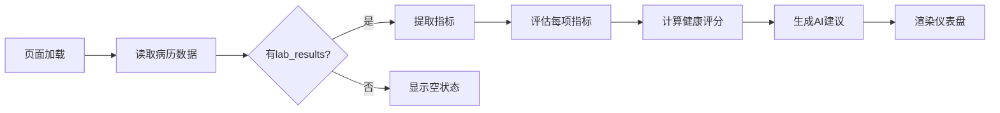

# 健康仪表盘智能升级文档

## 📅 更新日期
2024-10-09

## 🎯 升级概述

将健康仪表盘从**静态预设数据**升级为**基于病历的动态智能分析系统**，实现：
- ✅ 动态提取病历中的检查指标
- ✅ 智能评估每项指标的健康状态
- ✅ 可视化进度条展示（正常/偏高/偏低）
- ✅ 自动计算健康综合评分
- ✅ 生成个性化AI健康建议

---

## ✨ 核心功能

### 1. 智能指标提取与评估

#### 功能特点
- **自动识别**：从病历的 `lab_results` 字段自动提取检查指标
- **智能评估**：根据预设的健康标准自动判断指标状态
- **多类型支持**：支持血常规、肝功能、血脂、血糖、心电图等多种检查

#### 数据结构
```json
{
  "lab_results": {
    "category": "blood",  // 检查类别
    "metrics": [
      {
        "name": "白细胞计数",
        "value": 11.2,
        "unit": "×10⁹/L"
      }
    ]
  }
}
```

### 2. 进度条可视化系统

#### 设计理念
采用**彩色进度条**直观展示健康状态：

| 状态 | 颜色 | 进度范围 | 说明 |
|------|------|----------|------|
| 正常 | 绿色渐变 | 40-60% | 指标在正常范围内 |
| 偏低 | 蓝色渐变 | 0-40% | 低于正常下限 |
| 偏高 | 橙色渐变 | 60-100% | 高于正常上限 |
| 严重异常 | 红色渐变 | 0% 或 100% | 严重偏离正常值 |

#### 可视化元素
- **进度条主体**：显示当前值的位置
- **正常范围标记**：虚线框标注健康区间
- **动态指示器**：脉动圆点标记当前值
- **参考范围标签**：显示最小值、最优值、最大值

### 3. 健康评分系统

#### 计算规则
```javascript
评分 = Σ(各指标得分) / 指标总数

指标得分规则：
- 正常：100分
- 偏高/偏低：70分
- 严重异常：40分
- 未知：60分
```

#### 评级标准
- **90-100分**：优秀 ⭐⭐⭐⭐⭐
- **80-89分**：良好 ⭐⭐⭐⭐
- **70-79分**：中等 ⭐⭐⭐
- **60-69分**：及格 ⭐⭐
- **<60分**：需改善 ⭐

### 4. AI智能建议

#### 建议生成逻辑
1. **异常指标分析**：识别所有异常指标
2. **针对性建议**：根据具体异常类型生成建议
3. **通用健康建议**：补充生活方式建议
4. **用药提醒**：如果有处方，添加用药提醒

#### 建议类型
- 🚨 **紧急提醒**：严重异常指标的就医建议
- ⚠️ **关注提醒**：轻微异常的注意事项
- 💊 **用药提醒**：按医嘱服药提醒
- 🥗 **生活方式**：饮食、运动、作息建议
- ✅ **鼓励信息**：指标正常时的鼓励

---

## 🏥 支持的检查类型

### 1. 血常规检查 (blood)

| 指标名称 | 正常范围 | 单位 |
|----------|----------|------|
| 白细胞计数 | 4.0-10.0 | ×10⁹/L |
| 红细胞计数 | 4.0-5.5 | ×10¹²/L |
| 血红蛋白 | 120-160 | g/L |
| 血小板 | 100-300 | ×10⁹/L |
| 血细胞比容 | 37-50 | % |
| 中性粒细胞 | 50-70 | % |
| 淋巴细胞 | 20-40 | % |

**示例病历**：
- ID: 3 - 血液检查报告（2025-09-15）
- 检出：白细胞计数偏高（11.2）

### 2. 肝功能检查 (liver)

| 指标名称 | 正常范围 | 单位 |
|----------|----------|------|
| 谷丙转氨酶 | 0-40 | U/L |
| 谷草转氨酶 | 0-40 | U/L |
| 总胆红素 | 3.4-20.5 | μmol/L |
| 直接胆红素 | 0-6.8 | μmol/L |
| 总蛋白 | 60-80 | g/L |
| 白蛋白 | 35-55 | g/L |

**示例病历**：
- ID: 5 - 肝功能检查报告（2025-08-10）
- 检出：谷丙转氨酶偏高（55）、谷草转氨酶偏高（48）

### 3. 血脂检查 (lipid)

| 指标名称 | 正常范围 | 单位 |
|----------|----------|------|
| 总胆固醇 | 2.8-5.7 | mmol/L |
| 甘油三酯 | 0.4-1.7 | mmol/L |
| 高密度脂蛋白 | 1.0-2.5 | mmol/L |
| 低密度脂蛋白 | 0-3.4 | mmol/L |

**示例病历**：
- ID: 6 - 血脂检查报告（2025-07-25）
- 检出：总胆固醇偏高（6.2）、低密度脂蛋白偏高（3.8）

### 4. 血糖检查 (glucose)

| 指标名称 | 正常范围 | 单位 |
|----------|----------|------|
| 空腹血糖 | 3.9-6.1 | mmol/L |
| 餐后2小时血糖 | 3.9-7.8 | mmol/L |
| 糖化血红蛋白 | 4.0-6.0 | % |

**示例病历**：
- ID: 7 - 血糖检查报告（2025-07-10）
- 全部正常

### 5. 心电图检查 (ecg)

| 指标名称 | 正常范围 | 单位 |
|----------|----------|------|
| 心率 | 60-100 | 次/分 |
| PR间期 | 120-200 | ms |
| QRS时限 | 60-100 | ms |
| QT间期 | 350-440 | ms |

**示例病历**：
- ID: 4 - 心电图检查（2025-08-20）
- 全部正常

### 6. 肾功能检查 (kidney)

| 指标名称 | 正常范围 | 单位 |
|----------|----------|------|
| 尿素氮 | 2.9-7.1 | mmol/L |
| 肌酐 | 44-133 | μmol/L |
| 尿酸 | 150-420 | μmol/L |

**示例病历**：
- 暂无，可扩展添加

### 7. 甲状腺功能 (thyroid)

| 指标名称 | 正常范围 | 单位 |
|----------|----------|------|
| TSH | 0.27-4.2 | mIU/L |
| T3 | 1.3-3.1 | nmol/L |
| T4 | 66-181 | nmol/L |

**示例病历**：
- 暂无，可扩展添加

---

## 📊 UI/UX 设计

### 1. 健康评分卡片

```
┌─────────────────────────────────────┐
│  健康综合评分       2024/10/09      │
│                                      │
│           ┌─────────┐                │
│           │   85    │                │
│           │  /100   │                │
│           └─────────┘                │
│              良好                     │
│                                      │
│  ↗  2项需关注                        │
└─────────────────────────────────────┘
```

### 2. 病历分析概览

```
┌─────────────────────────────────────┐
│  病历分析概览                        │
│  基于最近上传病历的智能分析          │
│                                      │
│  [血液检查报告]    2025-09-15       │
│  血常规检查显示白细胞计数略高...     │
│  [已分析] [1项异常]                  │
└─────────────────────────────────────┘
```

### 3. 健康指标详情（进度条）

```
┌─────────────────────────────────────┐
│  ◆  白细胞计数              [偏高]  │
│     11.2 ×10⁹/L                     │
│                                      │
│  ├──────────────●───────────────┤   │
│  4.0        最优       10.0         │
│                                      │
│  白细胞计数偏高，当前值11.2...       │
└─────────────────────────────────────┘

图例：
├─────┤  正常范围标记（虚线框）
●        当前值指示器（脉动圆点）
━━━━━    进度条（渐变色）
```

### 4. AI健康建议

```
┌─────────────────────────────────────┐
│  AI健康建议        ◉ 基于病历分析   │
│                                      │
│  ! 关注白细胞异常                   │
│    白细胞计数偏高，建议多休息...     │
│                              [查看›] │
│                                      │
│  + 按时服药                         │
│    根据医嘱按时服用抗炎药物...       │
│                              [查看›] │
└─────────────────────────────────────┘
```

---

## 🔄 数据流程

### 1. 加载流程



### 2. 指标评估流程

```javascript
输入: { name: "白细胞计数", value: 11.2, unit: "×10⁹/L" }
↓
查找健康标准: min=4.0, max=10.0
↓
判断状态: 11.2 > 10.0 → status="high"
↓
计算进度: progress = 65%
↓
输出: {
  status: "high",
  statusText: "偏高",
  statusColor: "#FFAB40",
  progress: 65,
  ...
}
```

---

## 💡 使用示例

### 示例1：血常规异常

**病历数据**：
```json
{
  "id": 3,
  "title": "血液检查报告",
  "lab_results": {
    "category": "blood",
    "metrics": [
      { "name": "白细胞计数", "value": 11.2, "unit": "×10⁹/L" },
      { "name": "红细胞计数", "value": 4.5, "unit": "×10¹²/L" },
      ...
    ]
  }
}
```

**展示效果**：
- 健康评分：85分（良好）
- 异常指标：1项（白细胞偏高）
- AI建议：
  - ⚠️ 关注白细胞异常
  - 💊 按时服药
  - 🥗 健康生活方式

### 示例2：血脂异常

**病历数据**：
```json
{
  "id": 6,
  "title": "血脂检查报告",
  "lab_results": {
    "category": "lipid",
    "metrics": [
      { "name": "总胆固醇", "value": 6.2, "unit": "mmol/L" },
      { "name": "低密度脂蛋白", "value": 3.8, "unit": "mmol/L" },
      ...
    ]
  }
}
```

**展示效果**：
- 健康评分：78分（中等）
- 异常指标：2项（胆固醇、低密度脂蛋白偏高）
- AI建议：
  - ⚠️ 控制血脂水平
  - 🥗 低脂饮食
  - 🏃 增加运动

### 示例3：全部正常

**病历数据**：
```json
{
  "id": 7,
  "title": "血糖检查报告",
  "lab_results": {
    "category": "glucose",
    "metrics": [
      { "name": "空腹血糖", "value": 5.3, "unit": "mmol/L" },
      { "name": "糖化血红蛋白", "value": 5.2, "unit": "%" }
    ]
  }
}
```

**展示效果**：
- 健康评分：100分（优秀）
- 异常指标：0项
- AI建议：
  - ✅ 健康状况良好
  - 📋 定期体检

---

## 🎨 颜色系统

### 状态颜色

| 状态 | 主色 | 渐变 | 用途 |
|------|------|------|------|
| 正常 | #37CD87 | 绿色渐变 | 正常指标、成功状态 |
| 偏低 | #4FACFE | 蓝色渐变 | 低于正常值 |
| 偏高 | #FFAB40 | 橙色渐变 | 高于正常值 |
| 危险 | #FF5252 | 红色渐变 | 严重异常 |
| 未知 | #9E9E9E | 灰色渐变 | 无法评估 |

### 指标图标渐变

每个指标都有独特的渐变色背景：
- 白细胞：紫色渐变
- 红细胞：粉红渐变
- 血红蛋白：橙粉渐变
- 血小板：蓝色渐变
- 转氨酶：绿色/粉色渐变
- 胆固醇：紫粉渐变

---

## 🔧 技术实现

### 核心文件

1. **健康标准配置**
   - 文件：`/src/config/health-standards.js`
   - 功能：定义所有检查指标的正常范围和评估逻辑

2. **进度条组件**
   - 文件：`/src/components/HealthMetricBar.vue`
   - 功能：可视化展示单个健康指标

3. **仪表盘组件**
   - 文件：`/src/components/HealthDashboard.vue`
   - 功能：整合所有功能，展示完整的健康仪表盘

4. **病历数据**
   - 文件：`/src/static/mock/records.json`
   - 功能：包含各类检查的示例数据

### 关键函数

```javascript
// 评估健康指标
evaluateHealthMetric(name, value, category) → {
  status, statusText, statusColor, 
  progress, icon, gradient, min, max, optimal
}

// 计算健康评分
calculateHealthScore(metrics) → score (0-100)

// 生成AI建议
generateSuggestions(metrics, record) → suggestions[]
```

---

## 📱 响应式设计

### 移动端优化
- 进度条触摸友好（高度20rpx）
- 卡片间距适中（16-24rpx）
- 字体大小适配小屏幕
- 图标尺寸清晰可见

### 动画效果
- 进度条填充动画（0.6s）
- 指示器脉动效果（2s循环）
- 光泽扫过效果（2s循环）
- 卡片点击缩放反馈

---

## 🚀 扩展性

### 1. 添加新的检查类型

在 `health-standards.js` 中添加：

```javascript
export const healthStandards = {
  // ... 现有类型
  
  newType: {
    '新指标名称': {
      unit: '单位',
      min: 最小值,
      max: 最大值,
      optimal: 最优值,
      icon: '图标',
      gradient: '渐变色'
    }
  }
}
```

### 2. 自定义评估逻辑

修改 `evaluateHealthMetric` 函数，支持更复杂的评估规则。

### 3. 扩展AI建议

在 `generateSuggestions` 中添加新的建议规则。

---

## ✅ 测试清单

- [x] 血常规检查显示正确
- [x] 肝功能检查显示正确
- [x] 血脂检查显示正确
- [x] 血糖检查显示正确
- [x] 心电图检查显示正确
- [x] 健康评分计算正确
- [x] 进度条颜色正确
- [x] 正常范围标记正确
- [x] AI建议生成正确
- [x] 空状态显示正确
- [x] 动画效果流畅
- [x] 响应式布局正常

---

## 🎯 后续优化方向

### 短期计划
1. ✅ 添加肾功能、甲状腺功能检查支持
2. ✅ 优化进度条算法，更精确地反映偏离程度
3. ✅ 添加历史趋势对比功能
4. ✅ 支持多份病历的综合分析

### 长期规划
1. 🔄 接入真实AI分析API
2. 🔄 OCR自动识别病历图片中的数值
3. 🔄 自然语言理解病历文本
4. 🔄 生成更个性化的健康建议
5. 🔄 添加健康目标设定和跟踪
6. 🔄 导出健康报告PDF

---

## 📚 参考资料

### 健康标准来源
- 中华医学会临床检验标准
- 世界卫生组织(WHO)指南
- 国家卫生健康委员会标准

### 技术参考
- Vue 3 Composition API
- UniApp 跨平台开发
- 数据可视化最佳实践

---

## 👥 维护者

HealthCare 开发团队

**最后更新**：2024-10-09

